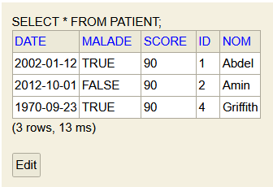

# Lab 2

### Dependencies

We need several dependencies in order to develop this project, namely:

- JPA (Java Persistence API): ORM Framework for mapping Java objects to entities in a relational database.
- H2: A lightweight RDBMS written in Java, similar to Mysql.
- JDBC (Java DataBase Connectivity): API for DataBase manipulation.
- Spring Web: Used for the creation of web services.
- Lombok: For reducing boilerplate code

## Patient Application

### JPA Entity of the class Patient

```java

@Entity
@Data
@AllArgsConstructor
@NoArgsConstructor
public class Patient {
    @Id
    @GeneratedValue(strategy = GenerationType.IDENTITY)
    private Long id;
    private String nom;
    private LocalDate date;
    private boolean malade;
    private int score;
}
```

### Configuration of persistence unit

```properties
spring.application.name=Patient
server.port=8080
spring.datasource.url=jdbc:h2:mem:patients-db
spring.datasource.username=Yahya
spring.datasource.password=Yahya
spring.jpa.hibernate.ddl-auto=update
spring.h2.console.enabled=true
```

### JPA Patient Repository

```java
public interface PatientRepository extends JpaRepository<Patient, Long> {

    Patient findFirstBy();

    List<Patient> findPatientByNomContaining(String nom);
}
```

### Operations Test

```java

@Override
public void run(String... args) throws Exception {
    patientRepository.save(new Patient(null, "Yahya", LocalDate.parse("2002-01-12"), true, 90));
    patientRepository.save(new Patient(null, "Amin", LocalDate.parse("2012-10-01"), false, 90));
    patientRepository.save(new Patient(null, "Guts", LocalDate.parse("1902-05-19"), true, 90));
    patientRepository.save(new Patient(null, "Griffith", LocalDate.parse("1970-09-23"), true, 90));

    System.out.println("----------------------------------------------------------------------");

    List<Patient> patients = patientRepository.findAll();
    System.out.println("Liste des Patients:");
    patients.forEach(patient -> {
        System.out.println("\t" + patient);
    });

    System.out.println("Consulter le premier patient:");
    System.out.println("\t" + patientRepository.findFirstBy());

    System.out.println("Chercher des patients");
    System.out.println("\t" + patientRepository.findById(1L));

    System.out.println("Chercher des patients par leurs noms");
    patientRepository.findPatientByNomContaining("G").forEach(patient -> {
        System.out.println("\t" + patient);
    });

    System.out.println("Metre à jour un patient:");
    Patient patient = patientRepository.findFirstBy();
    System.out.println("\tPatient original: " + patient);
    System.out.println("One change le nom.");
    patient.setNom("Abdel");
    System.out.println("\t" + patientRepository.save(patient));

    System.out.println("Supprimer un patient");
    patientRepository.deleteById(3L);
    System.out.println("\tListe des Patients avec un patient supprimé:");
    patientRepository.findAll().forEach(p -> {
        System.out.println("\t" + p);
    });
}
```

### Outputs

```
----------------------------------------------------------------------
Liste des Patients:
	Patient(id=1, nom=Yahya, date=2002-01-12, malade=true, score=90)
	Patient(id=2, nom=Amin, date=2012-10-01, malade=false, score=90)
	Patient(id=3, nom=Guts, date=1902-05-19, malade=true, score=90)
	Patient(id=4, nom=Griffith, date=1970-09-23, malade=true, score=90)
Consulter le premier patient:
	Patient(id=1, nom=Yahya, date=2002-01-12, malade=true, score=90)
Chercher des patients
	Optional[Patient(id=1, nom=Yahya, date=2002-01-12, malade=true, score=90)]
Chercher des patients par leurs noms
	Patient(id=3, nom=Guts, date=1902-05-19, malade=true, score=90)
	Patient(id=4, nom=Griffith, date=1970-09-23, malade=true, score=90)
Metre à jour un patient:
	Patient original: Patient(id=1, nom=Yahya, date=2002-01-12, malade=true, score=90)
One change le nom.
	Patient(id=1, nom=Abdel, date=2002-01-12, malade=true, score=90)
Supprimer un patient
	Liste des Patients avec un patient supprimé:
	Patient(id=1, nom=Abdel, date=2002-01-12, malade=true, score=90)
	Patient(id=2, nom=Amin, date=2012-10-01, malade=false, score=90)
	Patient(id=4, nom=Griffith, date=1970-09-23, malade=true, score=90)
----------------------------------------------------------------------
```



### MySQL DataBase

````properties
server.port=8080
spring.datasource.url=jdbc:mysql://localhost:3306/patients-db?createDatabaseIfNotExist=true
spring.datasource.username=root
spring.datasource.password=yahya
spring.jpa.hibernate.ddl-auto=update
sping.jpa.properties.hibernate.dialect=org.hibernate.dialect.MariaDBDialect
spring.h2.console.enabled=true
````

````mysql
mysql> SHOW tables;
+--------------------+
| Tables_in_patients |
+--------------------+
| patient            |
+--------------------+
1 row in set (0.00 sec)
````

````mysql
mysql> DESCRIBE patient;
+--------+--------------+------+-----+---------+----------------+
| Field  | Type         | Null | Key | Default | Extra          |
+--------+--------------+------+-----+---------+----------------+
| id     | bigint       | NO   | PRI | NULL    | auto_increment |
| date   | date         | YES  |     | NULL    |                |
| malade | bit(1)       | NO   |     | NULL    |                |
| nom    | varchar(255) | YES  |     | NULL    |                |
| score  | int          | NO   |     | NULL    |                |
+--------+--------------+------+-----+---------+----------------+
5 rows in set (0.01 sec)
````

````mysql
mysql> SELECT * FROM patient;
+----+------------+----------------+----------+-------+
| id | date       | malade         | nom      | score |
+----+------------+----------------+----------+-------+
|  1 | 2002-01-12 | 0x01           | Abdel    |    90 |
|  2 | 2012-10-01 | 0x00           | Amin     |    90 |
|  4 | 1970-09-23 | 0x01           | Griffith |    90 |
+----+------------+----------------+----------+-------+
3 rows in set (0.00 sec)
````

## Hospital Application

### Class Diagram
````mermaid
classDiagram
    class Patient {
    }

    class Doctor {
    }

    class Appointment {
    }

    class Consultation {
    }

    Patient "1"--"*" Appointment
    Doctor "1"--"*" Appointment
    Consultation "1"--"1" Appointment
````

## ManyToMany Application

### Class diagram

````mermaid
classDiagram
direction BT
class Role {
  + Role() 
  + Role(Long, String, List~User~) 
  - Long id
  - List~User~ users
  - String roleName
}
class RoleRepository {
<<Interface>>

}
class User {
  + User(String, String, String, List~Role~) 
  + User() 
  - String userName
  - String userId
  - String password
  - List~Role~ role
}
class UserController {
  + UserController(UserService) 
  - UserService userService
}
class UserRepository {
<<Interface>>

}
class UserService {
<<Interface>>

}
class UserServiceImpl {
  + UserServiceImpl(UserRepository, RoleRepository) 
  - UserRepository userRepository
  - RoleRepository roleRepository
}

Role "1" *--> "users *" User 
User "1" *--> "role *" Role 
UserController "1" *--> "userService 1" UserService 
UserServiceImpl "1" *--> "roleRepository 1" RoleRepository 
UserServiceImpl "1" *--> "userRepository 1" UserRepository 
UserServiceImpl  ..>  UserService 


````
